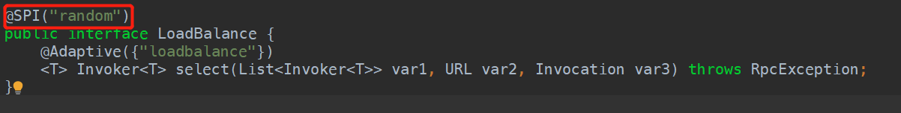
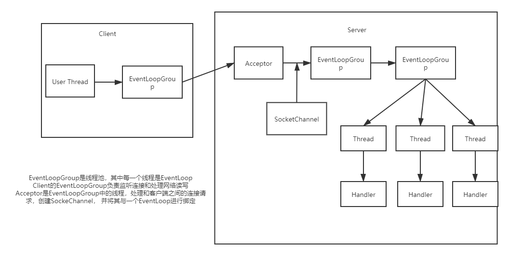

# dubbo_study

## dubbo直连

当Zookeeper宕机之后，dubbo服务（之前消费者调用过）之间仍然可以互相调用。

或者使用dubbo直连

`@Reference(url)`

## Dubbo的负载均衡

1. Random LoadBalance
   1. 基于权重的随机负载均衡己置
2. RoundRobin LoadBalance
   1. 基于权重的轮询负载均衡机制
3. LeastActive LoadBalance
   1. 最少活跃数-负载均衡
4. ConsistentHash LoadBalance
   1. **一致性hash**-负载均衡机制

默认为random权重




配置服务端的权重


## 服务降级

当服务器压力剧增的情况下，根据实际业务情况即流量，对一些业务和页面有策略的不处理或换种简单的处理方式，从而释放服务器资源保证核心交易正常运作或者高效运作。

可以通过服务降级功能临时屏蔽某个出错的非关键服务， 并定义降级后的返回策略。

```java
RegistryFactory registriFactory = ExtensionLoader.getExtensionLoader(RegistryFactory.class).getAdaptiveExtension();
Registry registry = registryFactory.getRegistry(YRL.valueOf("zookeeper://"));
registry.register(URL.valueOf("override://0.0.0.0/com.foo.BarService?category=configurators&dynamic=false&application=foo&mock=force:return+null"))
```

- `mock=force:return+null`标识消费方对该服务的方法调用都**直接返回null**，不发起远程调用。屏蔽补充要服务不可用时造成的影响
- 或者可以修改成为`mock=fail:return+null`表示对该服务的方法==调用失败==后，再返回null值，不抛异常。

消费降级


屏蔽：不发起远程调用

容错：服务调用失败后返回null


## 集群容错

1. FailOver Cluster： 失败后自动切换，失败后， 重试其他服务器

   ```xml
   <dubbo:service retries="2"/>
   ```

   

2. Failfast Cluster: 快速失败只发起一次调用， 失败后立即报错
3. FailSafe Cluster： 失败后自动恢复，定时重发
4. Forking Cluster: 并行多个服务器，只要一个成功即可以返回，` forks="2"`来设定最大并行数
5. Broadcast Cluster: 广播调用所有提供者，诸葛调用，任意一台摆错则报错。适用于缓存更新，日志等本地资源信息

### 集群模式配置

```xml
<dubbo:service cluster="failfast"></dubbo:service>
# 或者
<dubbo:reference cluster="failfast"></dubbo:reference>
```


#### 整合hystric

旨在通过控制访问远程系统，服务和第三方的节点，从而对延迟和故障提供更强大的容错能力。

Hystric具有回退机制和断路器功能的线程和信号隔离，请求缓存和请求打包，以及监控和配置等功能


## 原理

### Reactor模型

- 单线程模型： 所有IO操作都在一个NIO线程上操作完成
-  多线程模型：一组NIO线程操作
  - 一组NIO线程-Acceptor线程用于监听服务端， 接受客户端的TCP连接请求
  - 有一个NIO线程池，负责消息的读取、发送、编码、解码等
  - NIO线程能负责多个链路，但是一条链路只能由一个线程负责
- 主从多线程模型
  - 添加主线程用于客户都安的连接请求，一旦链路接力成功， 就将链路注册到线程池的IO线程上，由IO线程负责后续的IO操作。

### Netty线程模型

1. 线程模型分类
   1. 服务端线程模型， 类似于Reactor的**多线程模型**
   2. 客户端线程模型：由**客户端**创建**socketchannel**， 发起连接，线程池判断连接结果，连接成功，则监听**读操作**，否则监听连接操作，一旦连接成功则监听读操作。
2. Reactor线程NioEventLoop
   - 作为服务端Acceptor线程，处理客户端的连接请求
   - 作为客户端的connector， 注册监听连接操作位，判断异步连接结果
   - 作为IO线程， 监听读操作位， 负责SocketChannel中读取报文
   - IO线程，监听写操作位， 负责向SocketChannel写入报文发送给对方
   - 定时线程，执行定时任务，心跳检测等
   - 线程执行器，可以执行普通的任务线程
3. NIOEventLoop设计原理
   1. **串行化设计理念**：NioEventLoop线程池中有若干个NioEventLoop线程，每个线程**串行化**执行Handler链；每当有一个客户端接入，从线程池中获取一个可用的NioEventLoop线程，当数组到达上限之后，从0开始，每个客户都安连接一个线程，保证数据的安全。
   2. **定时任务和时间轮算法**：客户端连接超时，链路空闲检测：Netty的定时任务就是基于时间调度算法，首先查看**任务队列**中是否有**超时**的定时任务或者是普通任务，有则执行，没有就等待定时任务中**延迟最小**的任务的延迟时间，然后**扫描定时任务**，将限时的定时任务加入**任务队列**，在任务执行时，Netty每执行64个定时任务就检测一次是否到达上限，到达则推出，没有就执行完放到下次轮询时处理。
   3. Netty是个异步高性能NIO框架。


### Netty结构图



### Dubbo通信层

 

详细内容查看

https://blog.csdn.net/qq_41157588/article/details/106737191


DubboBeanDefinitionParser

将配置在XML文件中的各个配置内容读取，整合成不同的config类， 再将该类中的内容加载到SpringBean中


### SPI

#### Java SPI

SPI （Service Provider Interface）

Java SPI 在约定的Classpath下的MATE-INF/services/目录中创建一个**以服务接口命名的文件**， 文件里面记录的是**此jar包提供的具体实现类的全限定名**。

比如`java.sql.Driver`

在此包的MATE-INF/services/java.sql.Driver

`com.mysql.cj.jdbc.Driver`

demo:

```java
public interface James{
    void say();
}

public class NihaoJames implements James{
    @Override
    public void say(){
        System.out.println("Ni Hao James!!!");
    }
}

public class HelloJames implements James{
    @Override
    public void say(){
        System.out.prinltn("Hello James!!!");
    }
}


public class MainRun{
    public staic void main(String[] args){
        ServiceLoader<James> loder = ServiceLoader.load(James.class);
        Iterator<James> iterator = loader.iterator();
        while(iterator.hasNext()){
            James james = iterator.next();
            james.say();
        }
    }
}
```

在MATE-INF/services/路径下创建如下文件

```java
com.james.spi.NihaoJames
com.james.spi.HelloJames
```

### Java的SPI源码

首先有关ServiceLoader的源码

```java

public static <S> ServiceLoader<S> load(Class<S> service) {
    // 获取当前线程的ClassLoader
    ClassLoader cl = Thread.currentThread().getContextClassLoader();
    return ServiceLoader.load(service, cl);
}

public static <S> ServiceLoader<S> load(Class<S> service,ClassLoader loader)
{
    return new ServiceLoader<>(service, loader);
}

private ServiceLoader(Class<S> svc, ClassLoader cl) {
    service = Objects.requireNonNull(svc, "Service interface cannot be null");
    // 如果当前线程没有类加载，则使用系统的类加载
    loader = (cl == null) ? ClassLoader.getSystemClassLoader() : cl;
    acc = (System.getSecurityManager() != null) ? AccessController.getContext() : null;
    reload();
}

public void reload() {
    // 清除缓存中已经有的ClassLoader的内容
    providers.clear();
    //得到一个LazyIterator
    lookupIterator = new LazyIterator(service, loader);
}
```

总结的内容为先找当前**线程**绑定的ClassLoader， 如果没有就是用**SystemClassLoader**， 先清除缓存，然后创建一个LazyIterator

在LazyIterator中

```java
private boolean hasNextService() {
    if (nextName != null) {
        return true;
    }
    if (configs == null) {
        try {
            // 文件位置
            String fullName = PREFIX + service.getName();
            if (loader == null)
                //加载配置文件
                configs = ClassLoader.getSystemResources(fullName);
            else
                configs = loader.getResources(fullName);
        } catch (IOException x) {
            fail(service, "Error locating configuration files", x);
        }
    }
    // 按照行遍历文件内容
    while ((pending == null) || !pending.hasNext()) {
        if (!configs.hasMoreElements()) {
            return false;
        }
        // 解析
        pending = parse(service, configs.nextElement());
    }
    //给nextname赋值
    nextName = pending.next();
    return true;
}


private S nextService() {
    if (!hasNextService())
        throw new NoSuchElementException();
    String cn = nextName;
    nextName = null;
    Class<?> c = null;
    try {
        // 加载类
        c = Class.forName(cn, false, loader);
    } catch (ClassNotFoundException x) {
        fail(service,
             "Provider " + cn + " not found");
    }
    if (!service.isAssignableFrom(c)) {
        fail(service,
             "Provider " + cn  + " not a subtype");
    }
    try {
        // 创建实现类
        S p = service.cast(c.newInstance());
        // 放入缓存
        providers.put(cn, p);
        return p;
    } catch (Throwable x) {
        fail(service,
             "Provider " + cn + " could not be instantiated",
             x);
    }
    throw new Error();          // This cannot happen
}
```

### Java SPI 的缺陷

Java SPI 在查找扩展实现类的时候**遍历**SPI的配置文件， 并将**全部的类实例化**， 无法按需求去进行实例化

## Dubbo SPI

dubbo的文件配置如下所示(com.alibaba.dubbo.common.serialize.Serialization)

```java
fastjson=com.alibaba.dubbo.common.serialize.fastjson.FastJsonSerialization
fst=com.alibaba.dubbo.common.serialize.fst.FstSerialization
hessian2=com.alibaba.dubbo.common.serialize.hessian2.Hessian2Serialization
java=com.alibaba.dubbo.common.serialize.java.JavaSerialization
compactedjava=com.alibaba.dubbo.common.serialize.java.CompactedJavaSerialization
nativejava=com.alibaba.dubbo.common.serialize.nativejava.NativeJavaSerialization
kryo=com.alibaba.dubbo.common.serialize.kryo.KryoSerialization

```

Dubbo中使用SPI的

首先配置文件:

```java
nihaoJames = com.james.spi.NihaoJames
helloJames = com.james.spi.HelloJames
```


```java
ExtentionLoader<James> loader = ExtensionLoader.getExtensionLoader(James.class);

James nihao = loader.getExtension("nihaoJames");
```


首先`getExtensionLoader()`

```java

private static final ConcurrentMap<Class<?>, ExtensionLoader<?>> EXTENSION_LOADERS = new ConcurrentHashMap();
public static <T> ExtensionLoader<T> getExtensionLoader(Class<T> type) {
    ---------删除异常捕获的过程---------
        ExtensionLoader<T> loader = (ExtensionLoader)EXTENSION_LOADERS.get(type);
    if (loader == null) {
        EXTENSION_LOADERS.putIfAbsent(type, new ExtensionLoader(type));
        loader = (ExtensionLoader)EXTENSION_LOADERS.get(type);
    }

    return loader;
}
```

判断缓存中是否存在该类型的ExtensionLoader, 如果不存在那么就创建一个，并且加入到缓存当中。

`getExtension`方法

```java
public T getExtension(String name) {
    if (name != null && name.length() != 0) {
        // 返回默认的extension
        if ("true".equals(name)) {
            return this.getDefaultExtension();
        } else {
            //获取缓存中的目标对象
            Holder<Object> holder = (Holder)this.cachedInstances.get(name);
            if (holder == null) {
                // 不存在则创建并且加入到缓存中
                this.cachedInstances.putIfAbsent(name, new Holder());
                holder = (Holder)this.cachedInstances.get(name);
            }

            Object instance = holder.get();
            if (instance == null) {
                synchronized(holder) {
                    instance = holder.get();
                    if (instance == null) {
                        // 重点方法
                        instance = this.createExtension(name);
                        holder.set(instance);
                    }
                }
            }
            return instance;
        }
    } else {
        throw new IllegalArgumentException("Extension name == null");
    }
}
```

`createExtension`方法的实现

```java
    private T createExtension(String name) {
        // 获取实现类
        Class<?> clazz = (Class)this.getExtensionClasses().get(name);
        if (clazz == null) {
            throw this.findException(name);
        } else {
            try {
                // 查看是否已经在缓存中
                T instance = EXTENSION_INSTANCES.get(clazz);
                // 如果不存在那么利用反射创建
                if (instance == null) {
                    EXTENSION_INSTANCES.putIfAbsent(clazz, clazz.newInstance());
                    instance = EXTENSION_INSTANCES.get(clazz);
                }
				// 注入
                this.injectExtension(instance);
                Set<Class<?>> wrapperClasses = this.cachedWrapperClasses;
                Class wrapperClass;
                if (wrapperClasses != null && wrapperClasses.size() > 0) {
                    for(Iterator i$ e= wrapperClasses.iterator(); i$.hasNext(); instance = this.injectExtension(wrapperClass.getConstructor(this.type).newInstance(instance))) {
                        wrapperClass = (Class)i$.next();
                    }
                }

                return instance;
            } catch (Throwable var7) {
                throw new IllegalStateException("Extension instance(name: " + name + ", class: " + this.type + ")  could not be instantiated: " + var7.getMessage(), var7);
            }
        }
    }
```

